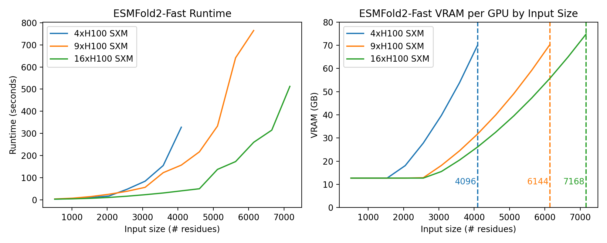

# Fold larger inputs by running ESMFold2 across several GPUs

`wrap_model_with_cp(model, dm, …)` takes a normal `ESMFold2Model` and rewires it, to spread one fold across several GPUs using the [Fold-CP methodology](https://github.com/NVIDIA-BioNeMo/boltz-cp) so you can fold longer
proteins than fit on a single GPU. Wrapping results in the same object with a few internal pieces swapped for versions that split their work across the GPUs.

## Table of contents

- [Quickstart](#quickstart)
- [Requirements](#requirements)
- [API: wrap_model_with_cp](#api-wrap_model_with_cp)
- [Behavior and differences from single-GPU implementation](#behavior-and-differences-from-single-gpu-implementation)
- [Larger example](#larger-example)
- [How context parallelism works](#how-context-parallelism-works)

## Quickstart

Install the fold-cp dependency

```bash
pip install "esm[fold-cp] @ git+https://github.com/Biohub/esm.git@main"
```

Use [esmfold2-cp.py](esmfold2-cp.py) as the CP version of the single-GPU
[esmfold2-none.py](esmfold2-none.py) example. Launch it with `torchrun`, using a
perfect-square number of GPUs:

```bash
# Launch on 4 GPUs
torchrun --nproc-per-node=4 esmfold2-cp.py
```

Compared with `esmfold2-none.py`, the `-cp.py` script changes setup, not the input or the `fold()` call:

- Assigns each process to its own CUDA device using `LOCAL_RANK` and `WORLD_SIZE` (set by `torchrun`)
- Initializes `DistributedManager` with `("cp", (n, n))`, where n is the `sqrt(WORLD_SIZE)`
- Wraps the normal `ESMFold2Model` with CP using `wrap_model_with_cp(model, dm, comm="ring")`
- It keeps `num_diffusion_samples=1`, which is required by the distributed diffusion path.

The wrapped model is still an `ESMFold2Model`; `fold()` and the result object are
unchanged.

## Requirements

- Python environment:
  - This ESM package
  - transformer-engine 2 (installed by `esm[fold-cp]` dependency)
- Use a perfect-square number of GPUs: 1, 4, 9, 16, ...
- Keep `num_diffusion_samples=1` in `ESMFold2InputBuilder().fold(...)`. The CP
  diffusion path currently expects one diffusion sample.
- If you enable `tp_esmc=True`, ESM-C's MLP hidden size must divide across the CP
  ranks. The current ESM-C `ffn_hidden=6912` works for 4, 9, and 16 GPUs.

> Use a fast GPU interconnect for good throughput. NVLink within a node and
  InfiniBand between nodes are the intended setup; PCIe or Ethernet work and still save
  memory, but communication may dominate runtime.

## API: wrap_model_with_cp

```python
replaced = wrap_model_with_cp(
    model,
    dm,
    comm="gather",
    bf16=True,
    offload_esmc=True,
    wrap_structure=True,
    tp_esmc=False,
)
```

`wrap_model_with_cp` mutates the existing `ESMFold2Model` in place and returns a
list of module paths that were replaced or augmented. The model type, `fold()` API,
and output object stay the same.

| Argument | Default | What it controls |
|---|---:|---|
| `model` | required | The `ESMFold2Model` to rewire. Load it normally with `from_pretrained(...)` first. |
| `dm` | required | The initialized `DistributedManager`; its CP mesh must be square. |
| `comm` | `"gather"` | MSA pair-weighted-averaging communication. Use `"gather"` for exact all-gather behavior, or `"ring"` for a cheaper online-softmax ring path on larger grids. |
| `bf16` | `True` | Runs the distributed trunk/MSA path in bf16. This is the practical default for lower memory and faster inference; use `False` only for tight fp32 parity checks. |
| `offload_esmc` | `True` | Moves the ESM-C language model back to CPU after its one-shot use, freeing GPU memory for the trunk and diffusion stages. |
| `wrap_structure` | `True` | Wraps the diffusion structure head so the conditioned pair representation can stay sharded through structure sampling. |
| `tp_esmc` | `False` | Tensor-parallelizes ESM-C's MLP across the CP ranks. Useful when ESM-C's replicated weights are the remaining memory floor. |

If you enable `tp_esmc=True`, ESM-C's MLP hidden size must divide across the CP ranks.
The current ESM-C `ffn_hidden=6912` works for `4`, `9`, and `16` GPUs.

Common choices:

```python
# Recommended large-input path.
wrap_model_with_cp(model, dm, comm="ring")

# Exact communication path; useful for parity checks.
wrap_model_with_cp(model, dm, comm="gather")

# Also shard ESM-C's MLP when ESM-C memory is the bottleneck.
wrap_model_with_cp(model, dm, comm="ring", tp_esmc=True)
```

After wrapping, keep `num_diffusion_samples=1` in the `fold()` call.

## Behavior and differences from single-GPU implementation

The API and outputs are identical (`from_pretrained`, `fold()`, output keys, `type(model)`), and almost every step matches the single-GPU result.
Two differences are expected, both small:

- **LM dropout** picks a different (still valid) random pattern than the single-GPU
  run, because the sharded table can't cheaply reproduce the exact full-table draw.
  This is the main reason the pTM/ipTM scores can wiggle slightly.
- **Rounding** differs at about 1e-3, because numbers are summed across GPUs in a
  different order.

Single-GPU kernel backends such as `"fused"` and `"cuequivariance"` are ignored by the CP-wrapped stages; those stages use the distributed CP implementations instead.

## Larger example

If you have a large 12-chain complex like [5xgo](https://www.rcsb.org/structure/5XGO), attempting to fold it on a single H100 80GB will fail with OOM

```bash
python will_fail.py   # expected to OOM
```

Context parallelism sharding will split the memory and allow this protein to be folded on 4x H100 SXM GPUs.
Launch with torchrun on a perfect-square number of GPUs:

```bash
PYTORCH_CUDA_ALLOC_CONF=expandable_segments:True torchrun --nproc-per-node=4 cuequivariance_cp.py
```

## How context parallelism works

A protein is a chain of building blocks called residues (`L` = how many).
To predict its shape, ESMFold2 keeps a big matrix with one cell for every pair of residues.
This is the pair representation (or just `z`), and it's what
dominates memory, because `L` residues means `L x L` cells:

- 500 residues → 250,000 cells
- 2,000 residues → 4,000,000 cells (16x bigger)

This means that the memory requirement scales quadratically with the input size.

Context parallelism (CP) shards tensors (vectors and matrices) across GPUs.
More GPUs means more memory for each tensor, allowing for larger inputs.

CP arranges the GPUs into a square grid so the GPU count must be a perfect square (e.g. 1, 4, 9, 16, …).
Each GPU process is a **rank**, and the total count is the **world size**.
The `L x L` matrix is split into blocks owned by each rank with a [PyTorch DTensor](https://docs.pytorch.org/docs/2.12/distributed.tensor.html).

The model weights are kept replicated, where each GPU has a copy.
Only the big activations get sharded in this method so per-GPU memory drops as GPUs are added to the inference pool.



### Stage-by-stage: what runs where

The base model runs every stage at full length `L` on every GPU, with the pair table
full-size. The table below walks that same pipeline; **a ✅ means
`wrap_model_with_cp` splits that stage across the grid** (everything else stays
replicated).

| Stage (base ESMFold2Model.forward) | Split across GPUs? | What wrapping does |
|---|---|---|
| `inputs_embedder` (atom features) | — (replicated) | unchanged; its cost grows only **linearly** with size (it looks at a small window of atoms at a time), so it stays a small, fixed floor |
| ESM-C 6B language model → embeddings | ✅ MLP only, if `tp_esmc=True` | splits ESM-C's big MLP across GPUs; the rest stays replicated; ESM-C is moved to CPU right after it's used, to free room |
| `language_model` → `lm_z` (`LxL`) | ✅ | `_cp_language_model` builds this `LxL` table already sharded (the full thing is never assembled on any GPU) |
| pair init (`z_init`, rel_pos, token_bonds, initial `z`, pair mask) | ✅ | `_cp_pair_init` builds each `LxL` table one block per GPU — no full copy anywhere. |
| recycle loop (`_run_one_loop`) | ✅ | `_cp_recycle_engine` keeps the pair table sharded the whole time — it never gathers the full table between passes |
| `parcae_readout` + `parcae_coda` | ✅ | runs on each GPU's block plus a shared trunk |
| `distogram_head(z + zᵀ)` | ✅ | works on the sharded table and gathers only the small result |
| `structure_head.sample` (diffusion → 3D coords) | ✅ (if `wrap_structure`) | runs the diffusion with the pair table kept sharded |
| `confidence_head` (pLDDT/PAE/PDE/pTM/ipTM scores) | ✅ | every `LxL` input (pair, rel_pos, token_bonds, distance bins, mask) stays sharded — nothing full-size is rebuilt; only the small final scores are gathered |

### Summary: what shrinks, what doesn't

- **Grows with the `LxL` pair table → now sharded:** pair init, recycle loop,
  parcae, distogram, structure, confidence. Each is built one block per GPU and never
  assembled full, so **adding GPUs raises the longest protein you can fold**.
- **Grows only with `L` (atom-level work):** `inputs_embedder` — a slow-growing,
  replicated floor.
- **Roughly fixed:** ESM-C's weights (split by `tp_esmc`); ESM-C's own activations are
  the remaining floor.
